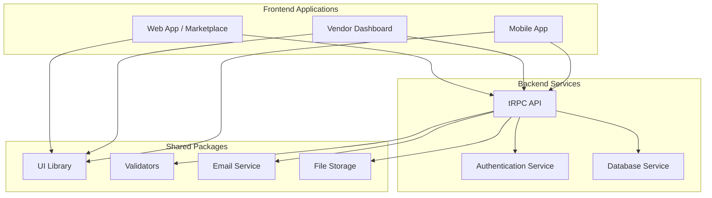

## 1. Introduction

Yukinu is a multi-vendor e-commerce platform built on a modern, scalable, and maintainable technology stack. The architecture is designed as a **monorepo** managed by **Turborepo**, which allows for efficient code sharing, streamlined dependency management, and unified development workflows across multiple applications and packages.

The system is composed of several loosely-coupled services and applications that communicate via a well-defined API, ensuring a clean separation of concerns and enabling independent development and deployment.

## 2. Core Components

The architecture consists of three primary layers:

1.  **Frontend Applications**: User-facing applications for customers and vendors.
2.  **Backend Services**: The core business logic, API, and data processing layer.
3.  **Shared Packages**: Reusable modules and libraries consumed by other parts of the system.

### Frontend Applications

- **Web App (Marketplace)**: The primary customer-facing storefront built with **Next.js**. It allows users to browse products, manage their accounts, and complete purchases.
- **Vendor Dashboard**: A dedicated interface built with **React** and **React Router** for vendors to manage their products, orders, and store settings.
- **Mobile App**: A cross-platform application for customers, developed with **React Native** and **Expo**.

### Backend Services

- **tRPC API**: A typesafe API layer that connects the frontend applications to the backend logic. Using tRPC ensures end-to-end type safety, reducing runtime errors and improving developer experience.
- **Authentication Service**: A custom-built service for managing user accounts, sessions, roles, and permissions.
- **Database Service**: Powered by **PostgreSQL** and **Drizzle ORM**, this service handles all data persistence and retrieval operations.

### Shared Packages

- **UI Library**: A collection of reusable React components based on **shadcn/ui** and **Base UI** to ensure a consistent look and feel across all web applications.
- **Validators**: A centralized package using **Zod** for data validation, ensuring that all data flowing into and out of the API is well-formed and type-correct.
- **Email Service**: An abstraction layer for sending transactional emails (e.g., welcome emails, password resets) via **Resend**.
- **File Storage**: A service for managing file uploads, such as product images and user avatars, using **Uploadthing**.

## 3. Technology Stack

| Layer          | Technology                                            |
| -------------- | ----------------------------------------------------- |
| Web App        | Next.js, React, TailwindCSS                           |
| Dashboard      | React, React Router, TailwindCSS                      |
| Mobile App     | React Native, Expo, Uniwind                           |
| Backend API    | tRPC, TypeScript                                      |
| Database & ORM | PostgreSQL + Drizzle ORM                              |
| Authentication | Custom auth + Accounts & Sessions system              |
| Validation     | Zod                                                   |
| Email Services | Resend                                                |
| File Storage   | Uploadthing                                           |
| UI Library     | Base UI, shadcn/ui                                    |
| Deployment     | Vercel or Docker, docker-compose, NGINX Reverse Proxy |

## 4. Data Flow

1.  A **User** interacts with one of the **Frontend Applications**.
2.  The frontend application sends a request to the **tRPC API**.
3.  The API uses the **Validators** package to sanitize and validate the incoming data.
4.  The request is routed to the appropriate service logic, which may involve the **Authentication Service**, **Database Service**, or other utilities like the **Email Service**.
5.  The service processes the request and interacts with the **PostgreSQL** database via the **Drizzle ORM**.
6.  The API returns a typed response to the frontend application.
7.  The frontend updates the UI to reflect the new state.

This architecture ensures a robust, scalable, and developer-friendly platform that can be easily extended with new features.
