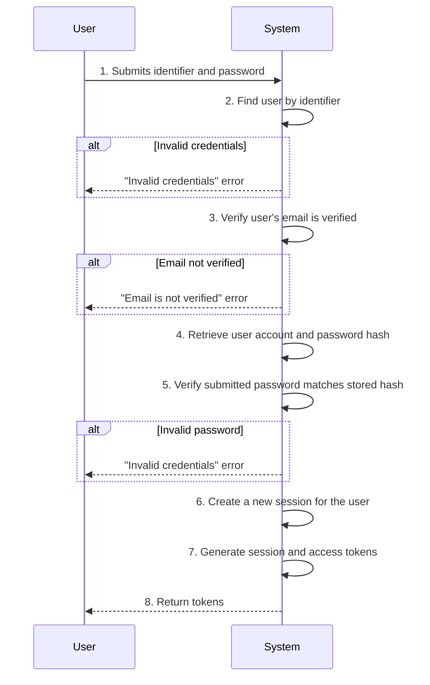
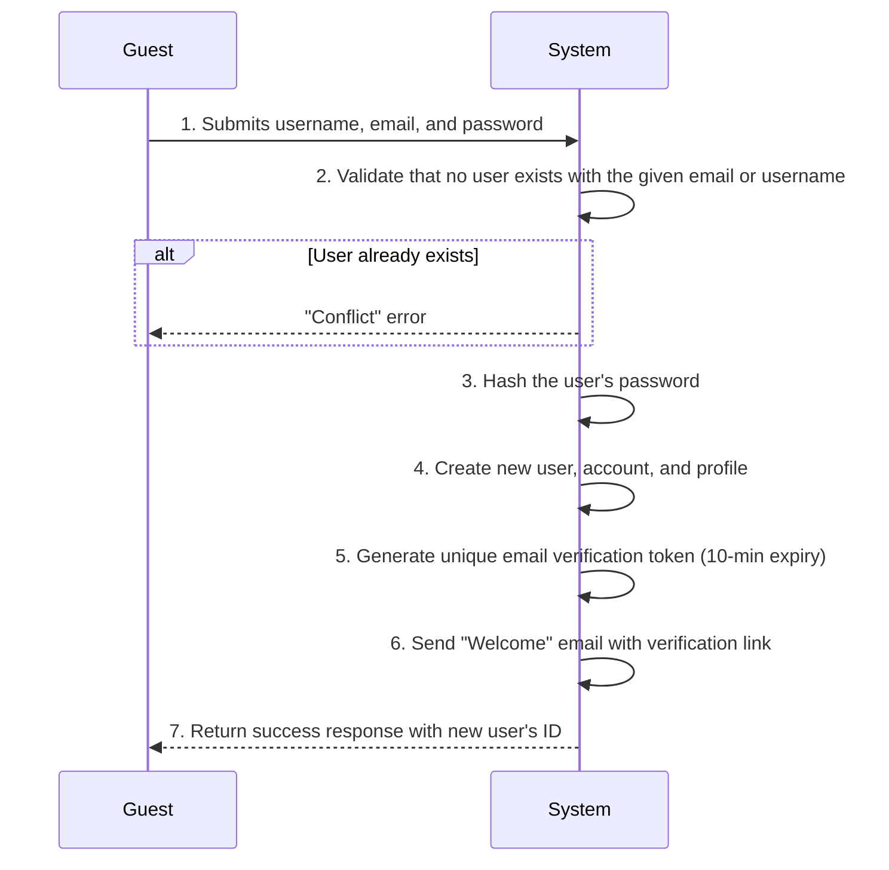
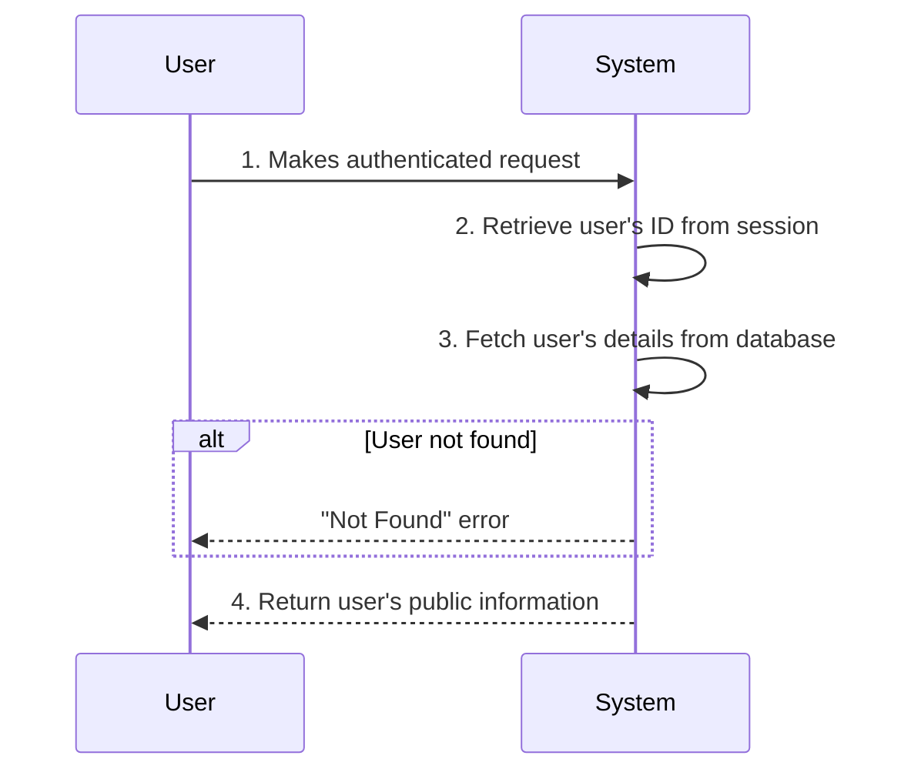
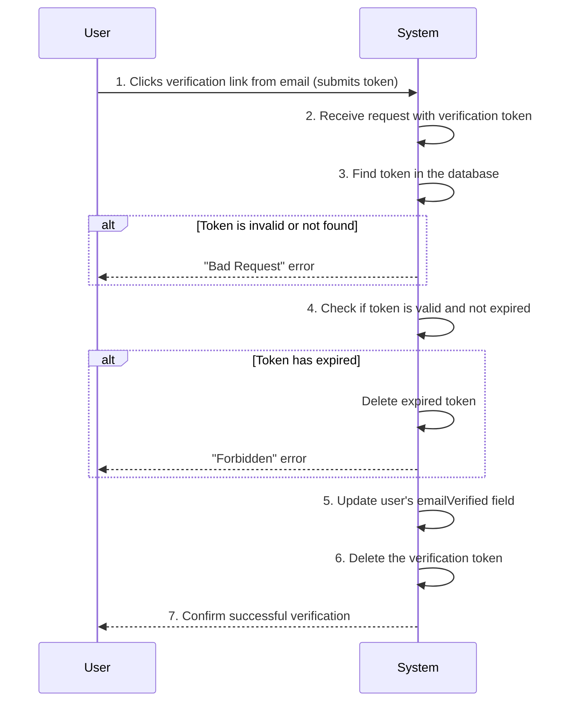
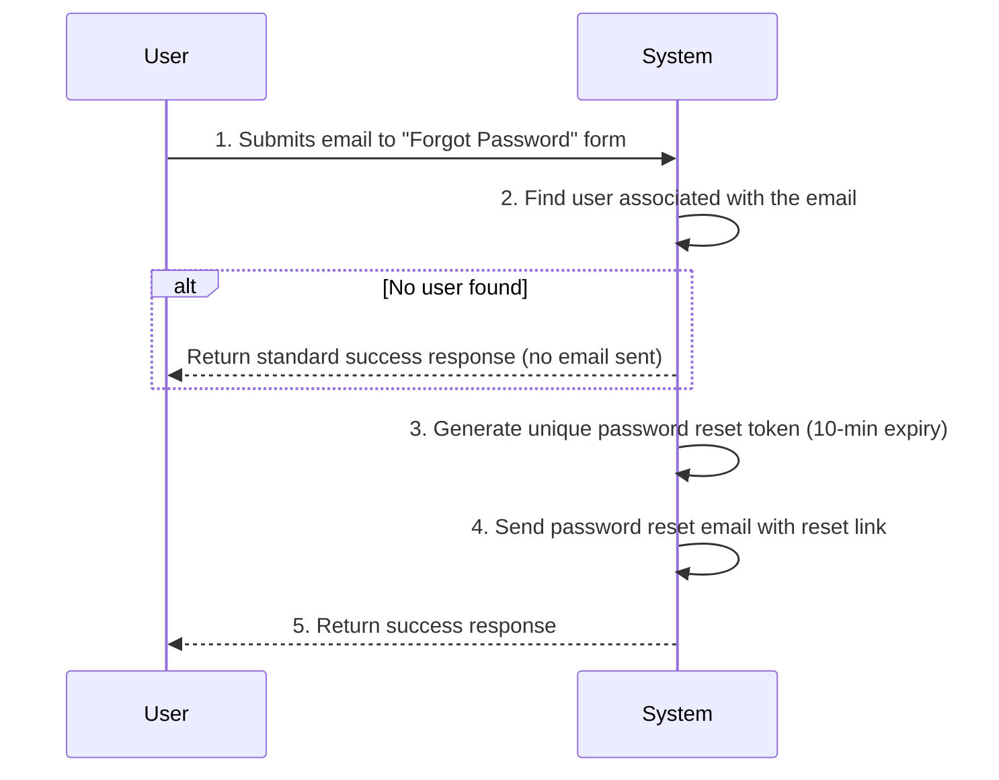
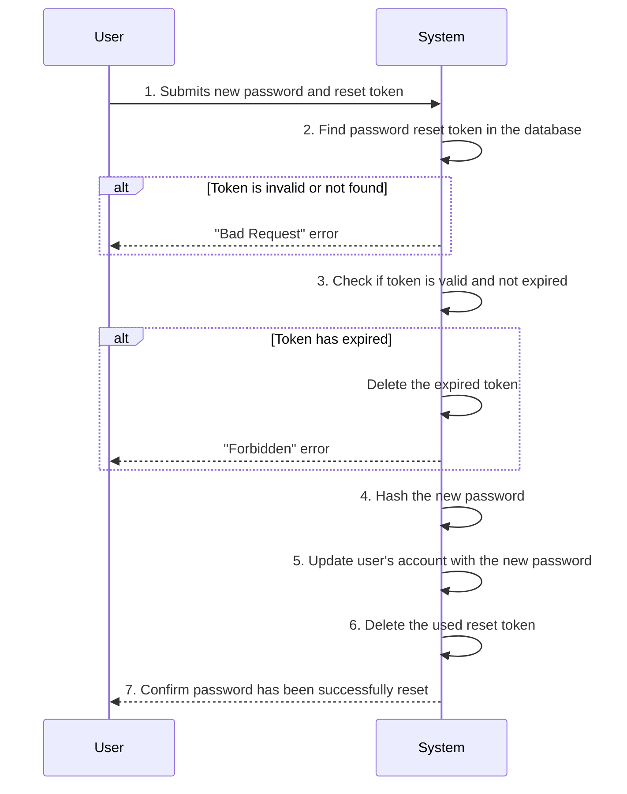

## User Login

```mermaid
sequenceDiagram
    participant User
    participant System

    User->>System: 1. Submits identifier and password
    System->>System: 2. Find user by identifier
    alt Invalid credentials
        System-->>User: "Invalid credentials" error
    end
    System->>System: 3. Verify user's email is verified
    alt Email not verified
        System-->>User: "Email is not verified" error
    end
    System->>System: 4. Retrieve user account and password hash
    System->>System: 5. Verify submitted password matches stored hash
    alt Invalid password
        System-->>User: "Invalid credentials" error
    end
    System->>System: 6. Create a new session for the user
    System->>System: 7. Generate session and access tokens
    System-->>User: 8. Return tokens
```

## User Registration

```mermaid
sequenceDiagram
    participant Guest
    participant System

    Guest->>System: 1. Submits username, email, and password
    System->>System: 2. Validate that no user exists with the given email or username
    alt User already exists
        System-->>Guest: "Conflict" error
    end
    System->>System: 3. Hash the user's password
    System->>System: 4. Create new user, account, and profile
    System->>System: 5. Generate unique email verification token (10-min expiry)
    System->>System: 6. Send "Welcome" email with verification link
    System-->>Guest: 7. Return success response with new user's ID
```

## Get Current User Information

```mermaid
sequenceDiagram
    participant User
    participant System

    User->>System: 1. Makes authenticated request
    System->>System: 2. Retrieve user's ID from session
    System->>System: 3. Fetch user's details from database
    alt User not found
        System-->>User: "Not Found" error
    end
    System-->>User: 4. Return user's public information
```

## Email Verification

```mermaid
sequenceDiagram
    participant User
    participant System

    User->>System: 1. Clicks verification link from email (submits token)
    System->>System: 2. Receive request with verification token
    System->>System: 3. Find token in the database
    alt Token is invalid or not found
        System-->>User: "Bad Request" error
    end
    System->>System: 4. Check if token is valid and not expired
    alt Token has expired
        System->>System: Delete expired token
        System-->>User: "Forbidden" error
    end
    System->>System: 5. Update user's emailVerified field
    System->>System: 6. Delete the verification token
    System-->>User: 7. Confirm successful verification
```

## Forgot Password

```mermaid
sequenceDiagram
    participant User
    participant System

    User->>System: 1. Submits email to "Forgot Password" form
    System->>System: 2. Find user associated with the email
    alt No user found
        System-->>User: Return standard success response (no email sent)
    end
    System->>System: 3. Generate unique password reset token (10-min expiry)
    System->>System: 4. Send password reset email with reset link
    System-->>User: 5. Return success response
```

## Reset Password

```mermaid
sequenceDiagram
    participant User
    participant System

    User->>System: 1. Submits new password and reset token
    System->>System: 2. Find password reset token in the database
    alt Token is invalid or not found
        System-->>User: "Bad Request" error
    end
    System->>System: 3. Check if token is valid and not expired
    alt Token has expired
        System->>System: Delete the expired token
        System-->>User: "Forbidden" error
    end
    System->>System: 4. Hash the new password
    System->>System: 5. Update user's account with the new password
    System->>System: 6. Delete the used reset token
    System-->>User: 7. Confirm password has been successfully reset
```
