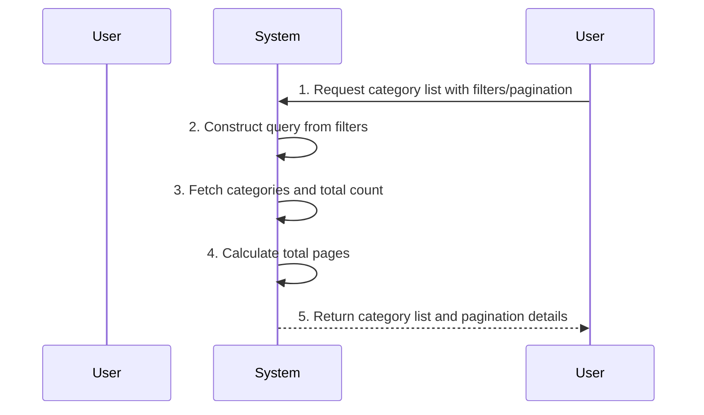
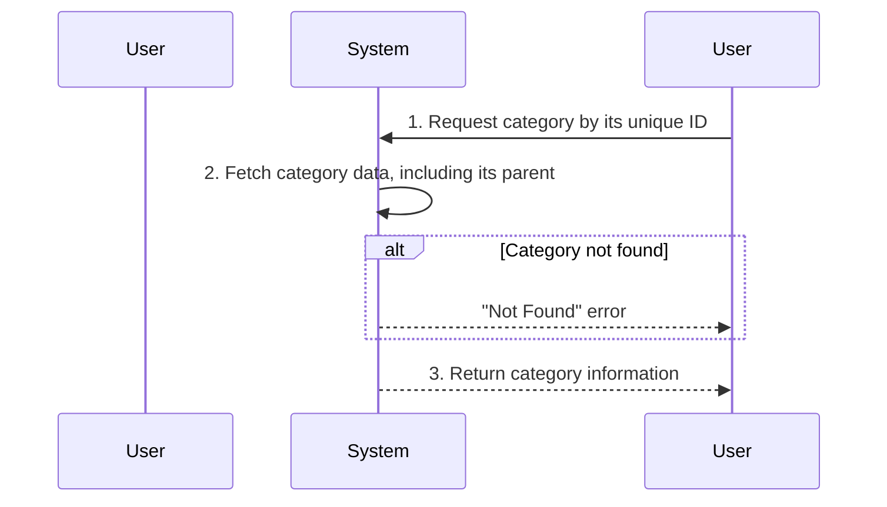
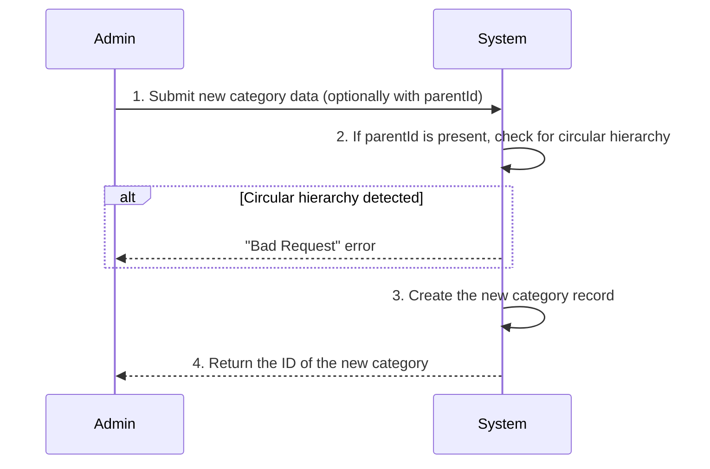
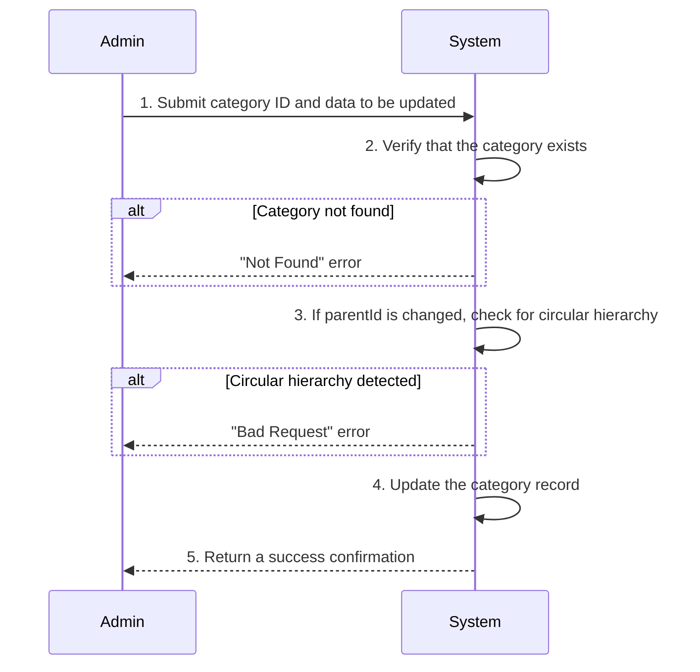
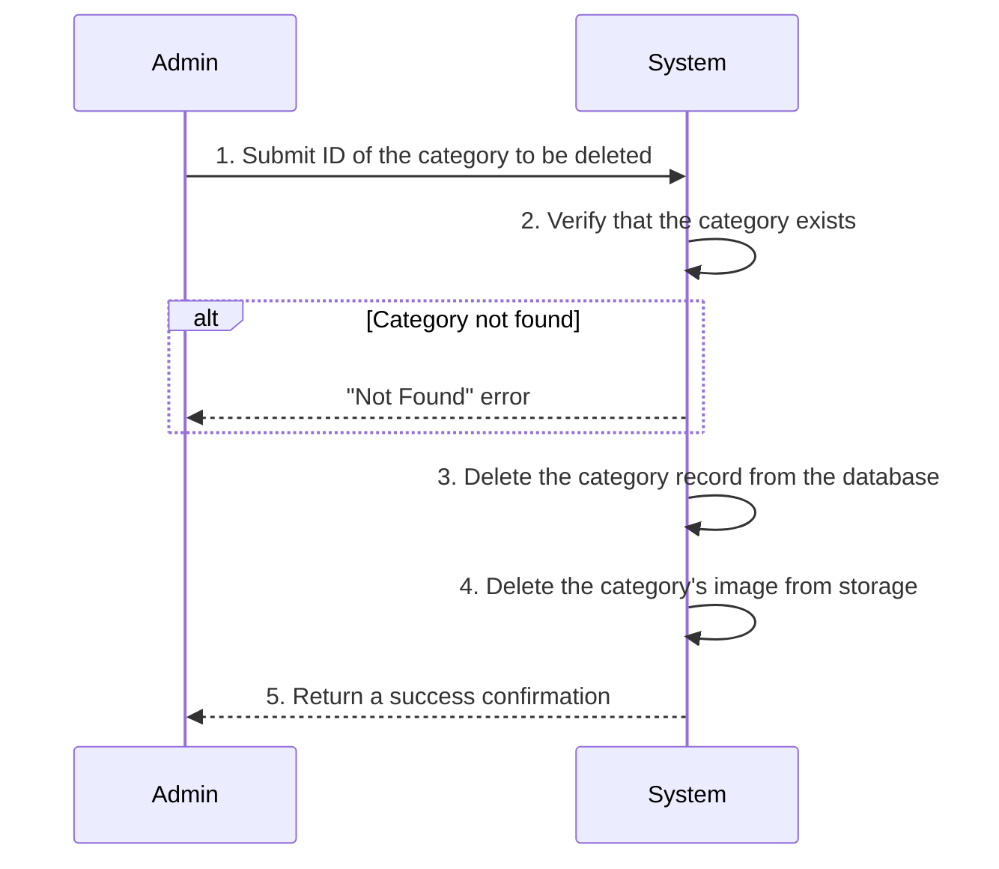

## Get All Categories

```mermaid
sequenceDiagram
    participant "Admin/User" as User
    participant System

    User->>System: 1. Request category list with filters/pagination
    System->>System: 2. Construct query from filters
    System->>System: 3. Fetch categories and total count
    System->>System: 4. Calculate total pages
    System-->>User: 5. Return category list and pagination details
```

## Get a Single Category

```mermaid
sequenceDiagram
    participant "Admin/User" as User
    participant System

    User->>System: 1. Request category by its unique ID
    System->>System: 2. Fetch category data, including its parent
    alt Category not found
        System-->>User: "Not Found" error
    end
    System-->>User: 3. Return category information
```

## Create Category

```mermaid
sequenceDiagram
    participant Admin
    participant System

    Admin->>System: 1. Submit new category data (optionally with parentId)
    System->>System: 2. If parentId is present, check for circular hierarchy
    alt Circular hierarchy detected
        System-->>Admin: "Bad Request" error
    end
    System->>System: 3. Create the new category record
    System-->>Admin: 4. Return the ID of the new category
```

## Update Category

```mermaid
sequenceDiagram
    participant Admin
    participant System

    Admin->>System: 1. Submit category ID and data to be updated
    System->>System: 2. Verify that the category exists
    alt Category not found
        System-->>Admin: "Not Found" error
    end
    System->>System: 3. If parentId is changed, check for circular hierarchy
    alt Circular hierarchy detected
        System-->>Admin: "Bad Request" error
    end
    System->>System: 4. Update the category record
    System-->>Admin: 5. Return a success confirmation
```

## Delete Category

```mermaid
sequenceDiagram
    participant Admin
    participant System

    Admin->>System: 1. Submit ID of the category to be deleted
    System->>System: 2. Verify that the category exists
    alt Category not found
        System-->>Admin: "Not Found" error
    end
    System->>System: 3. Delete the category record from the database
    System->>System: 4. Delete the category's image from storage
    System-->>Admin: 5. Return a success confirmation
```
