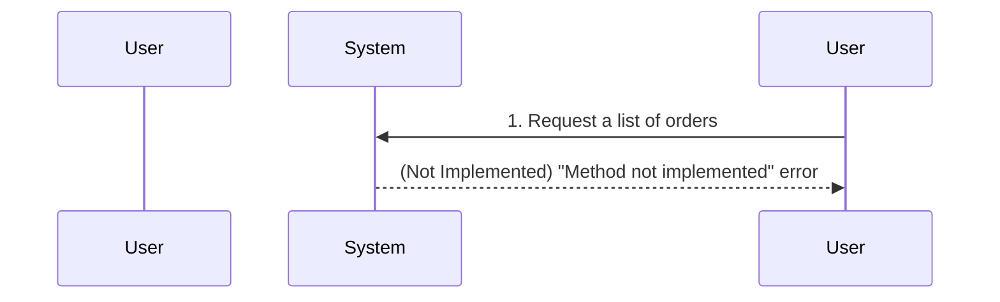
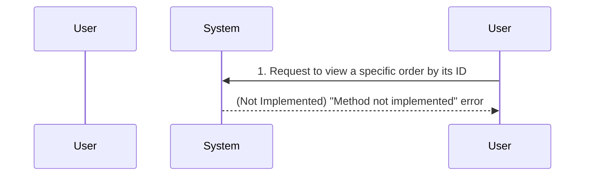
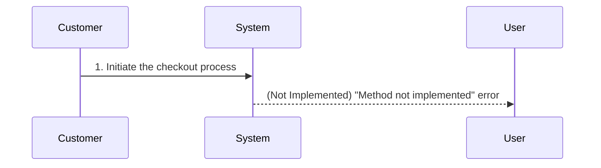
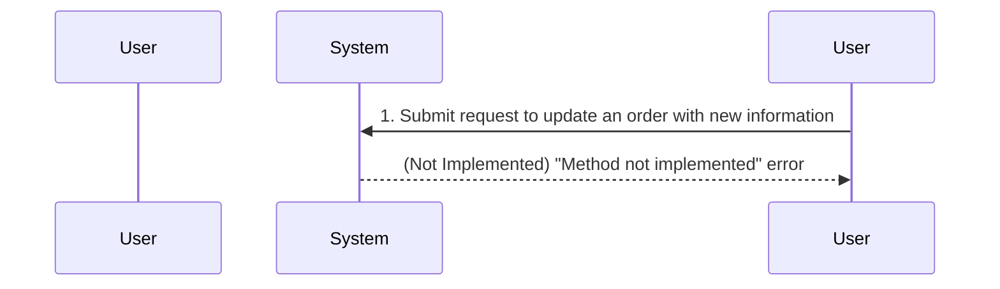

**Note:** The functionality for this service is not yet implemented. The diagrams below represent the intended flow.

## View All Orders

## View a Single Order

## Checkout

## Update an Order

