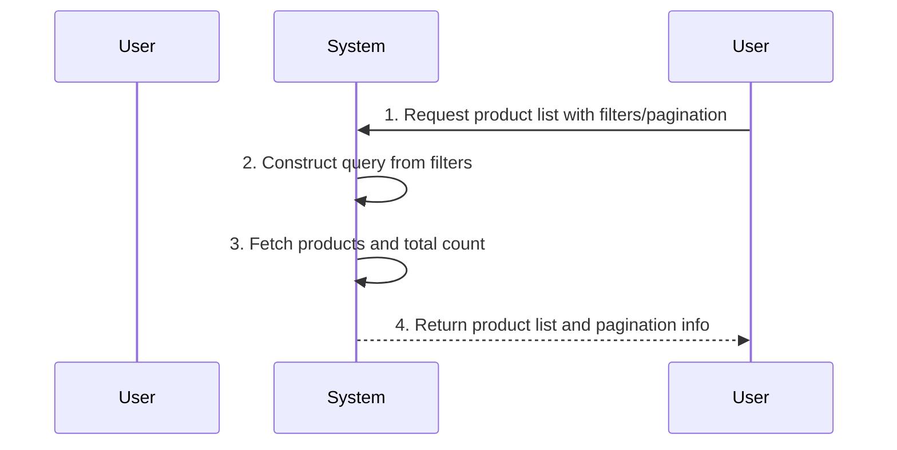
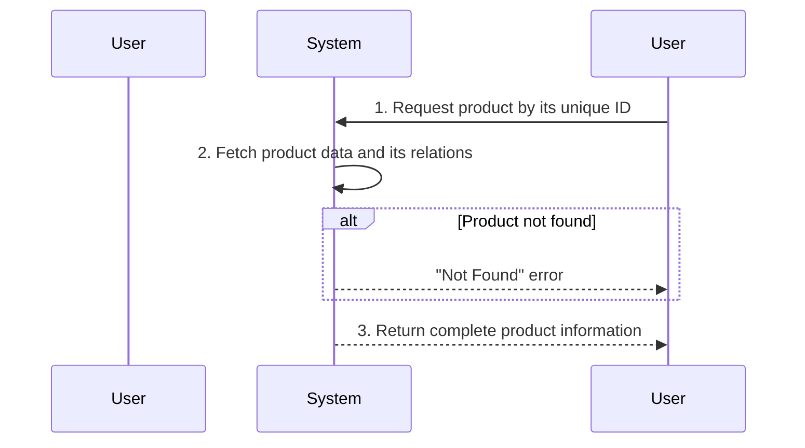
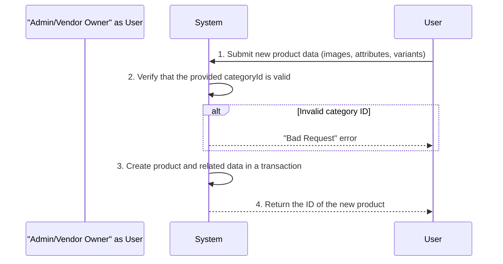
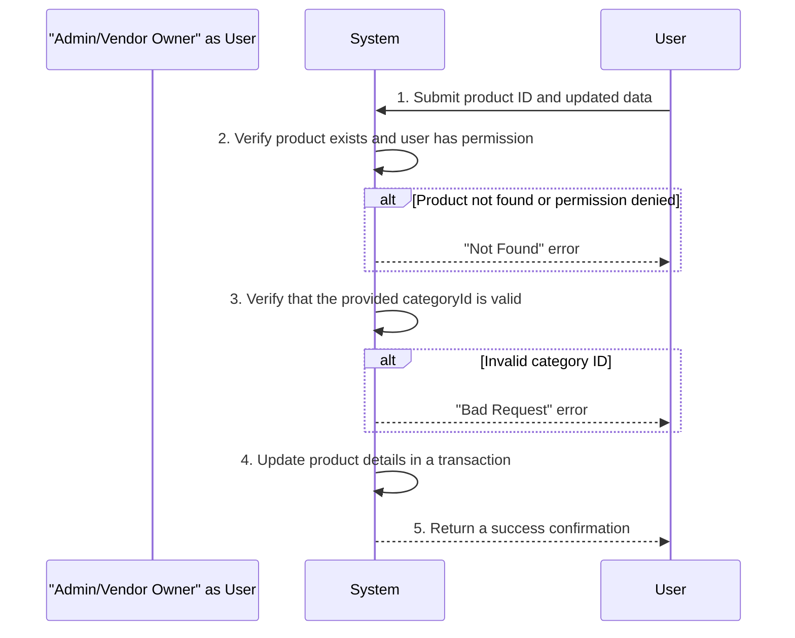
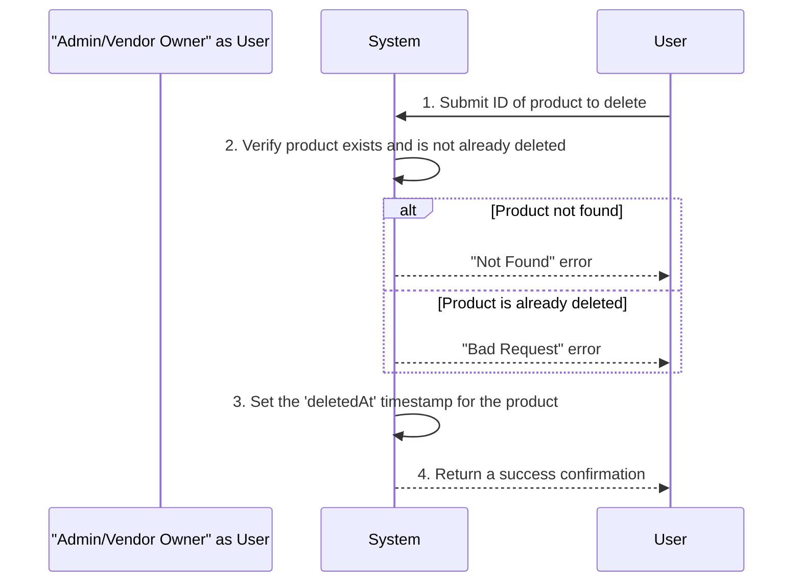
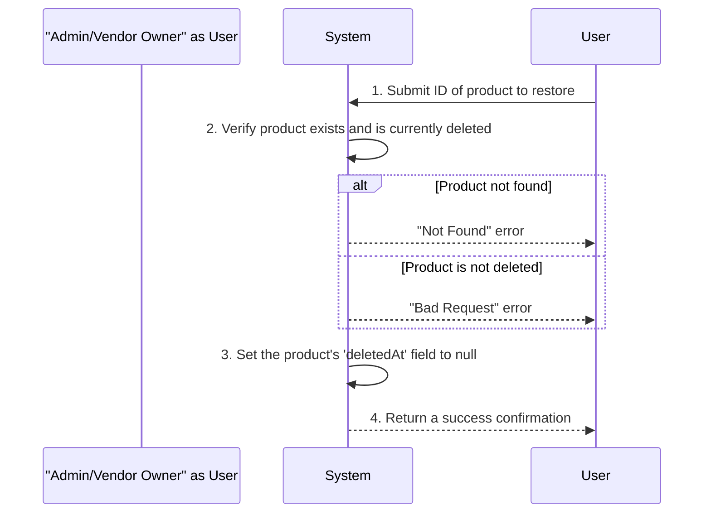
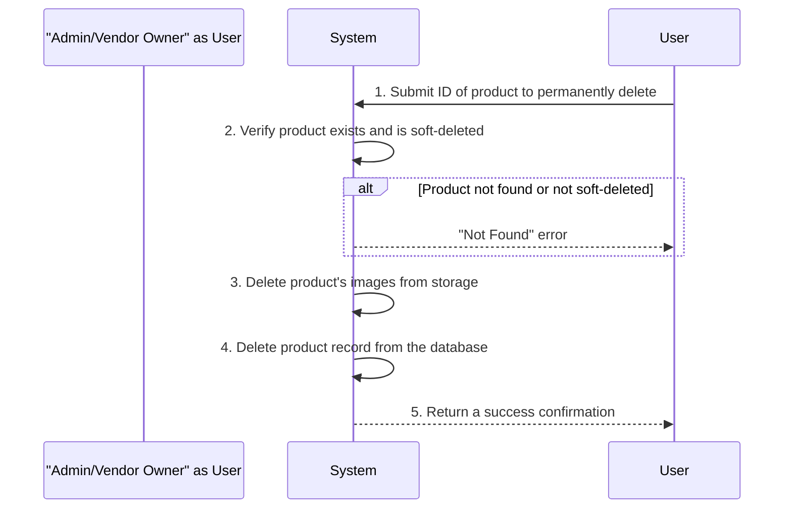

## Get All Products

```mermaid
sequenceDiagram
    participant "Admin/User" as User
    participant System

    User->>System: 1. Request product list with filters/pagination
    System->>System: 2. Construct query from filters
    System->>System: 3. Fetch products and total count
    System-->>User: 4. Return product list and pagination info
```

## Get a Single Product

```mermaid
sequenceDiagram
    participant "Admin/User" as User
    participant System

    User->>System: 1. Request product by its unique ID
    System->>System: 2. Fetch product data and its relations
    alt Product not found
        System-->>User: "Not Found" error
    end
    System-->>User: 3. Return complete product information
```

## Create Product

```mermaid
sequenceDiagram
    participant "Admin/Vendor Owner" as User
    participant System

    User->>System: 1. Submit new product data (images, attributes, variants)
    System->>System: 2. Verify that the provided categoryId is valid
    alt Invalid category ID
        System-->>User: "Bad Request" error
    end
    System->>System: 3. Create product and related data in a transaction
    System-->>User: 4. Return the ID of the new product
```

## Update Product

```mermaid
sequenceDiagram
    participant "Admin/Vendor Owner" as User
    participant System

    User->>System: 1. Submit product ID and updated data
    System->>System: 2. Verify product exists and user has permission
    alt Product not found or permission denied
        System-->>User: "Not Found" error
    end
    System->>System: 3. Verify that the provided categoryId is valid
    alt Invalid category ID
        System-->>User: "Bad Request" error
    end
    System->>System: 4. Update product details in a transaction
    System-->>User: 5. Return a success confirmation
```

## Delete Product (Soft Delete)

```mermaid
sequenceDiagram
    participant "Admin/Vendor Owner" as User
    participant System

    User->>System: 1. Submit ID of product to delete
    System->>System: 2. Verify product exists and is not already deleted
    alt Product not found
        System-->>User: "Not Found" error
    else Product is already deleted
        System-->>User: "Bad Request" error
    end
    System->>System: 3. Set the 'deletedAt' timestamp for the product
    System-->>User: 4. Return a success confirmation
```

## Restore Product

```mermaid
sequenceDiagram
    participant "Admin/Vendor Owner" as User
    participant System

    User->>System: 1. Submit ID of product to restore
    System->>System: 2. Verify product exists and is currently deleted
    alt Product not found
        System-->>User: "Not Found" error
    else Product is not deleted
        System-->>User: "Bad Request" error
    end
    System->>System: 3. Set the product's 'deletedAt' field to null
    System-->>User: 4. Return a success confirmation
```

## Permanently Delete Product

```mermaid
sequenceDiagram
    participant "Admin/Vendor Owner" as User
    participant System

    User->>System: 1. Submit ID of product to permanently delete
    System->>System: 2. Verify product exists and is soft-deleted
    alt Product not found or not soft-deleted
        System-->>User: "Not Found" error
    end
    System->>System: 3. Delete product's images from storage
    System->>System: 4. Delete product record from the database
    System-->>User: 5. Return a success confirmation
```
