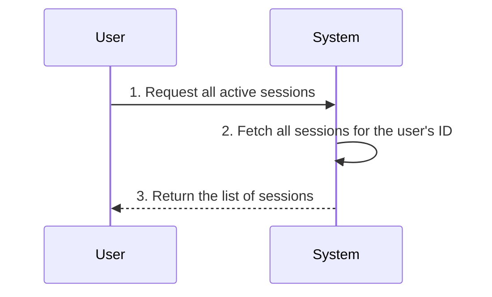
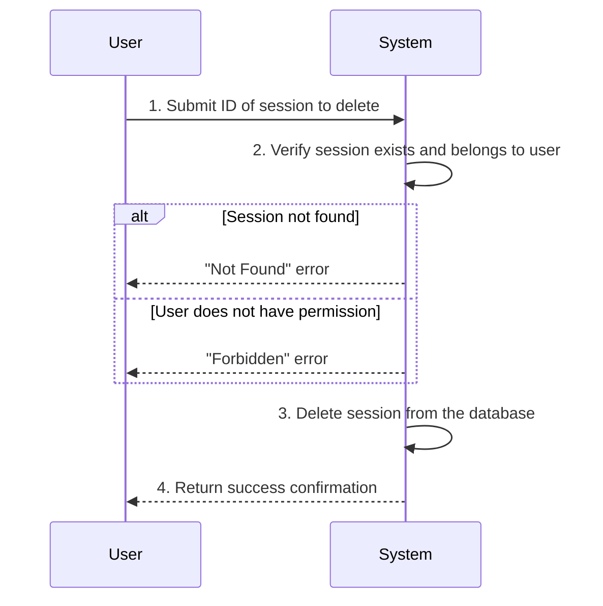
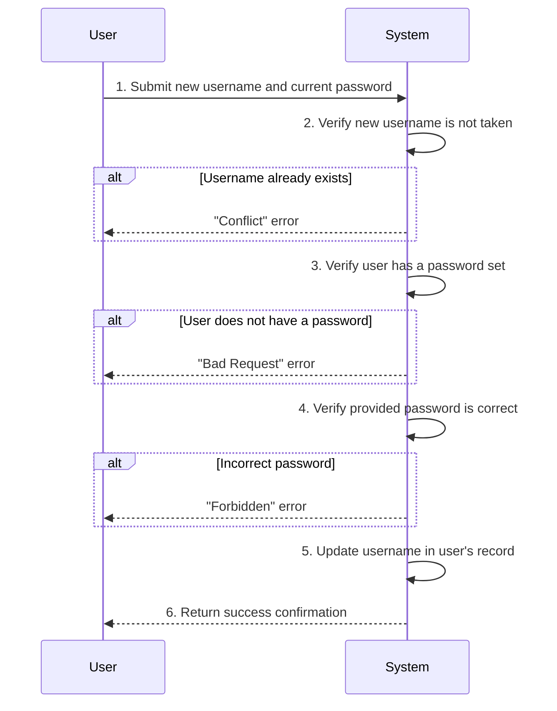
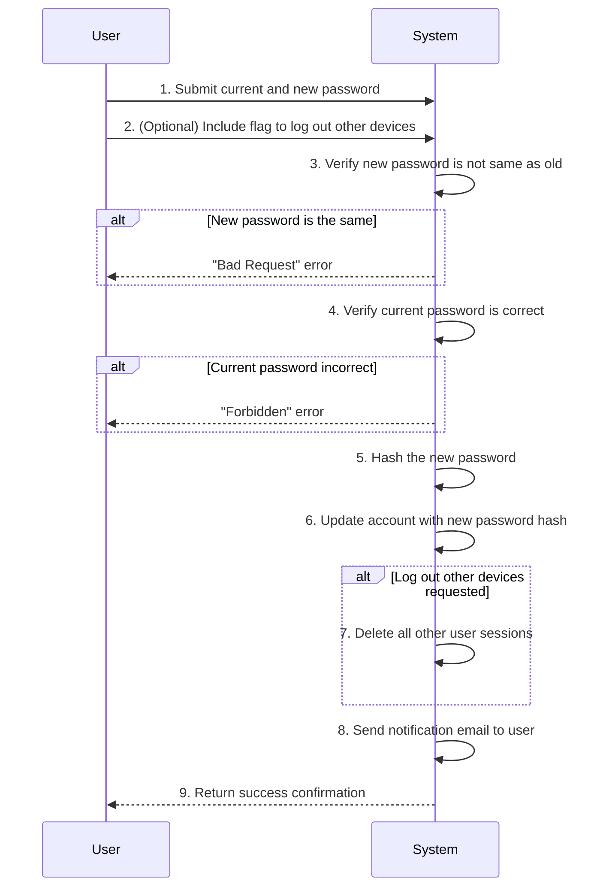
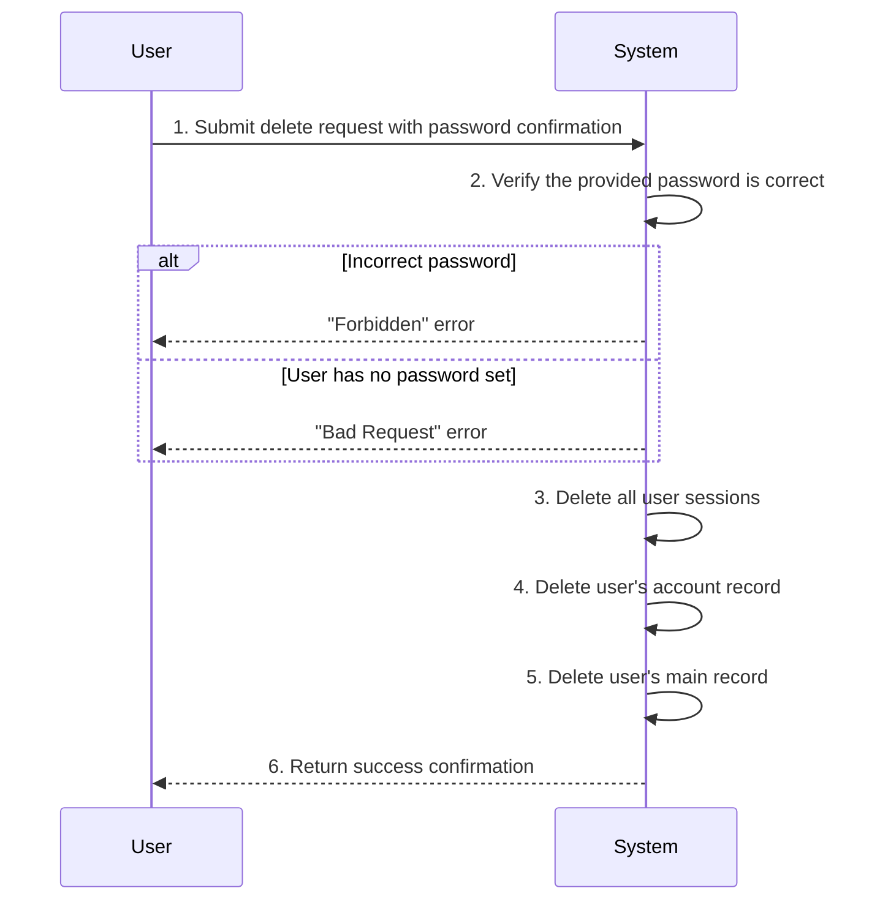

## Get All Sessions

```mermaid
sequenceDiagram
    participant User
    participant System

    User->>System: 1. Request all active sessions
    System->>System: 2. Fetch all sessions for the user's ID
    System-->>User: 3. Return the list of sessions
```

## Delete Session

```mermaid
sequenceDiagram
    participant User
    participant System

    User->>System: 1. Submit ID of session to delete
    System->>System: 2. Verify session exists and belongs to user
    alt Session not found
        System-->>User: "Not Found" error
    else User does not have permission
        System-->>User: "Forbidden" error
    end
    System->>System: 3. Delete session from the database
    System-->>User: 4. Return success confirmation
```

## Change Username

```mermaid
sequenceDiagram
    participant User
    participant System

    User->>System: 1. Submit new username and current password
    System->>System: 2. Verify new username is not taken
    alt Username already exists
        System-->>User: "Conflict" error
    end
    System->>System: 3. Verify user has a password set
    alt User does not have a password
        System-->>User: "Bad Request" error
    end
    System->>System: 4. Verify provided password is correct
    alt Incorrect password
        System-->>User: "Forbidden" error
    end
    System->>System: 5. Update username in user's record
    System-->>User: 6. Return success confirmation
```

## Change Password

```mermaid
sequenceDiagram
    participant User
    participant System

    User->>System: 1. Submit current and new password
    User->>System: 2. (Optional) Include flag to log out other devices
    System->>System: 3. Verify new password is not same as old
    alt New password is the same
        System-->>User: "Bad Request" error
    end
    System->>System: 4. Verify current password is correct
    alt Current password incorrect
        System-->>User: "Forbidden" error
    end
    System->>System: 5. Hash the new password
    System->>System: 6. Update account with new password hash
    alt Log out other devices requested
        System->>System: 7. Delete all other user sessions
    end
    System->>System: 8. Send notification email to user
    System-->>User: 9. Return success confirmation
```

## Delete Account

```mermaid
sequenceDiagram
    participant User
    participant System

    User->>System: 1. Submit delete request with password confirmation
    System->>System: 2. Verify the provided password is correct
    alt Incorrect password
        System-->>User: "Forbidden" error
    else User has no password set
        System-->>User: "Bad Request" error
    end
    System->>System: 3. Delete all user sessions
    System->>System: 4. Delete user's account record
    System->>System: 5. Delete user's main record
    System-->>User: 6. Return success confirmation
```
