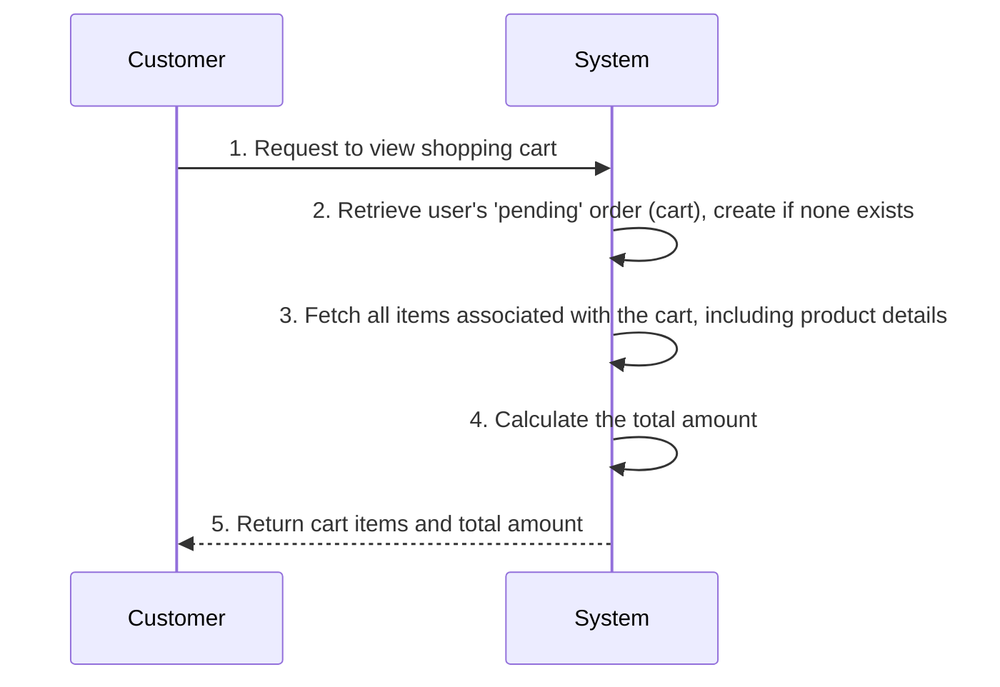
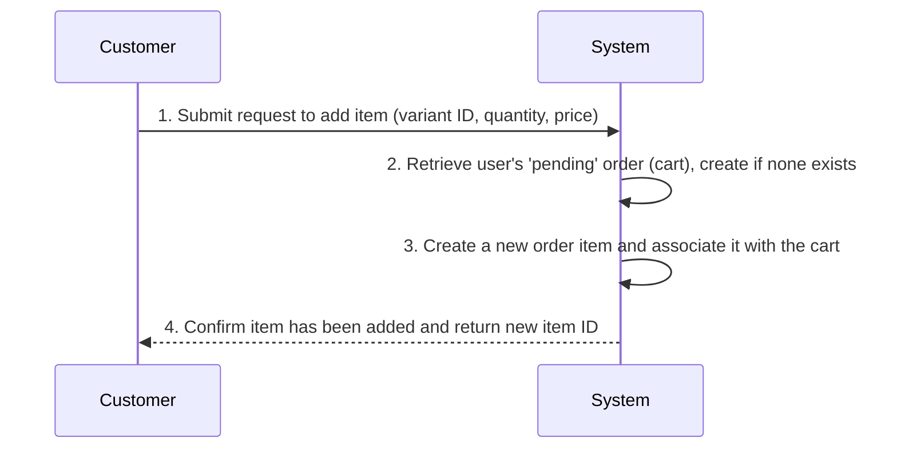
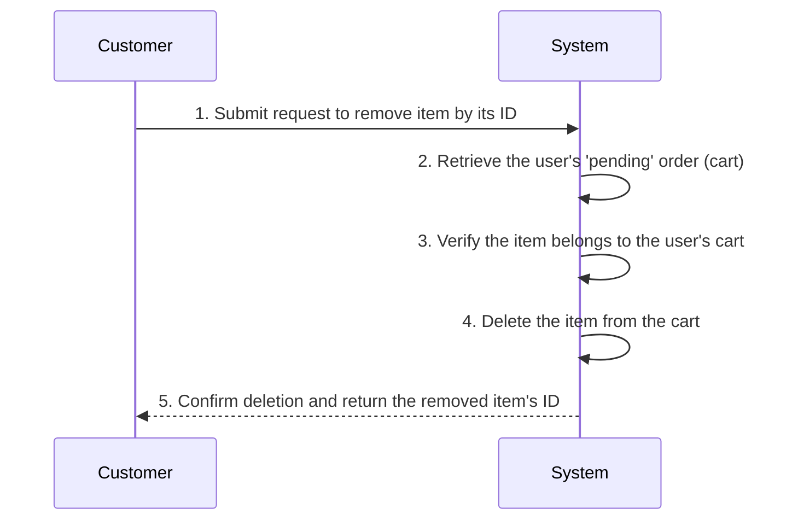

## View Shopping Cart

```mermaid
sequenceDiagram
    participant Customer
    participant System

    Customer->>System: 1. Request to view shopping cart
    System->>System: 2. Retrieve user's 'pending' order (cart), create if none exists
    System->>System: 3. Fetch all items associated with the cart, including product details
    System->>System: 4. Calculate the total amount
    System-->>Customer: 5. Return cart items and total amount
```

## Add Item to Shopping Cart

```mermaid
sequenceDiagram
    participant Customer
    participant System

    Customer->>System: 1. Submit request to add item (variant ID, quantity, price)
    System->>System: 2. Retrieve user's 'pending' order (cart), create if none exists
    System->>System: 3. Create a new order item and associate it with the cart
    System-->>Customer: 4. Confirm item has been added and return new item ID
```

## Remove Item from Shopping Cart

```mermaid
sequenceDiagram
    participant Customer
    participant System

    Customer->>System: 1. Submit request to remove item by its ID
    System->>System: 2. Retrieve the user's 'pending' order (cart)
    System->>System: 3. Verify the item belongs to the user's cart
    System->>System: 4. Delete the item from the cart
    System-->>Customer: 5. Confirm deletion and return the removed item's ID
```
