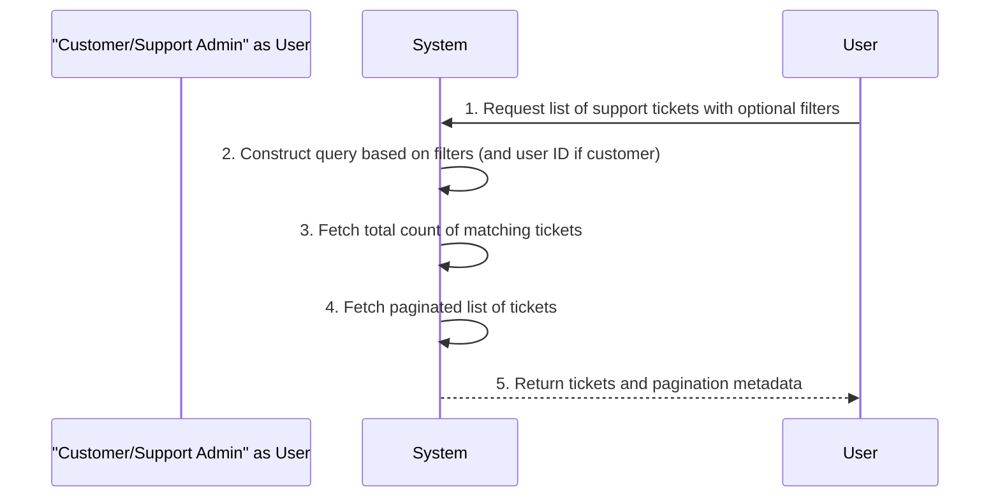
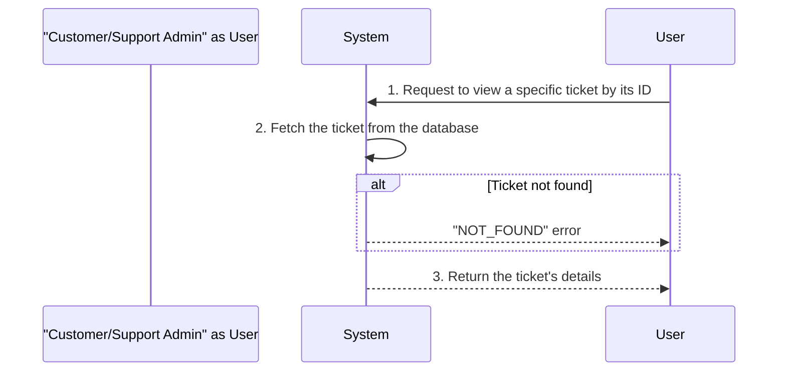
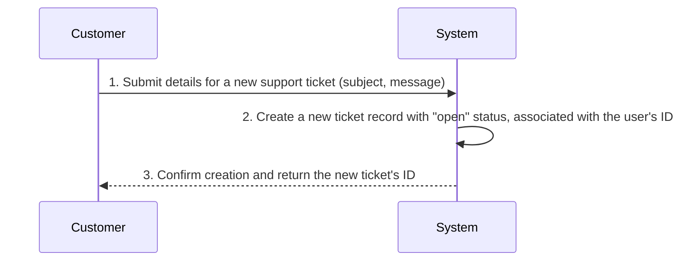
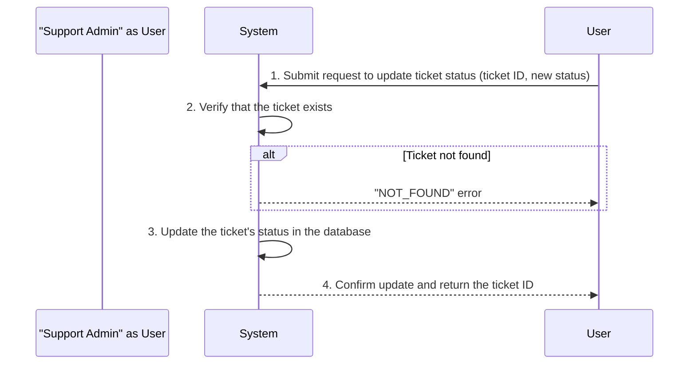

## View All Support Tickets

```mermaid
sequenceDiagram
    participant "Customer/Support Admin" as User
    participant System

    User->>System: 1. Request list of support tickets with optional filters
    System->>System: 2. Construct query based on filters (and user ID if customer)
    System->>System: 3. Fetch total count of matching tickets
    System->>System: 4. Fetch paginated list of tickets
    System-->>User: 5. Return tickets and pagination metadata
```

## View a Single Support Ticket

```mermaid
sequenceDiagram
    participant "Customer/Support Admin" as User
    participant System

    User->>System: 1. Request to view a specific ticket by its ID
    System->>System: 2. Fetch the ticket from the database
    alt Ticket not found
        System-->>User: "NOT_FOUND" error
    end
    System-->>User: 3. Return the ticket's details
```

## Create a New Support Ticket

```mermaid
sequenceDiagram
    participant Customer
    participant System

    Customer->>System: 1. Submit details for a new support ticket (subject, message)
    System->>System: 2. Create a new ticket record with "open" status, associated with the user's ID
    System-->>Customer: 3. Confirm creation and return the new ticket's ID
```

## Update Support Ticket Status

```mermaid
sequenceDiagram
    participant "Support Admin" as User
    participant System

    User->>System: 1. Submit request to update ticket status (ticket ID, new status)
    System->>System: 2. Verify that the ticket exists
    alt Ticket not found
        System-->>User: "NOT_FOUND" error
    end
    System->>System: 3. Update the ticket's status in the database
    System-->>User: 4. Confirm update and return the ticket ID
```
