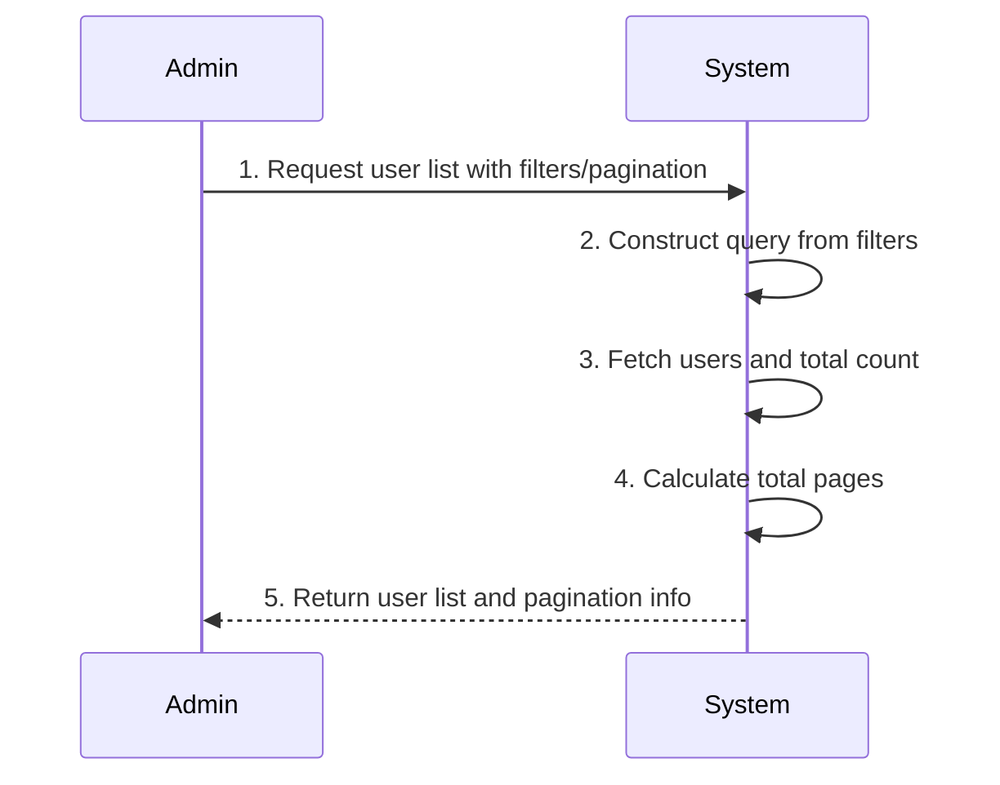
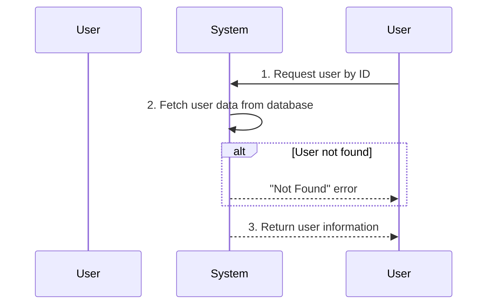
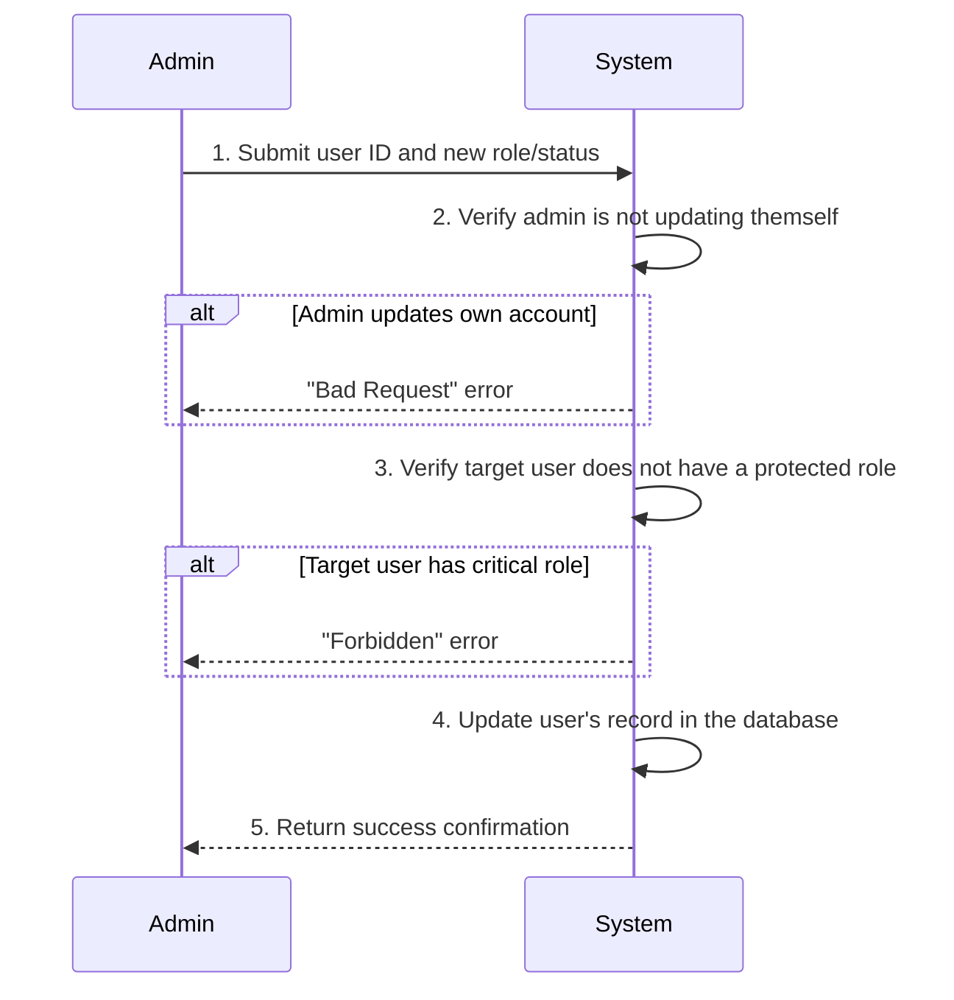
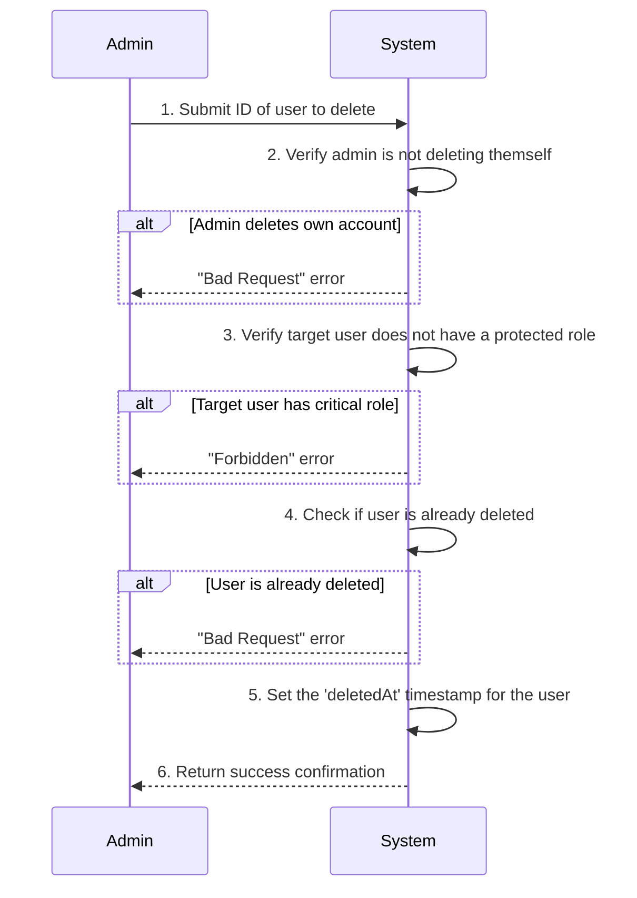
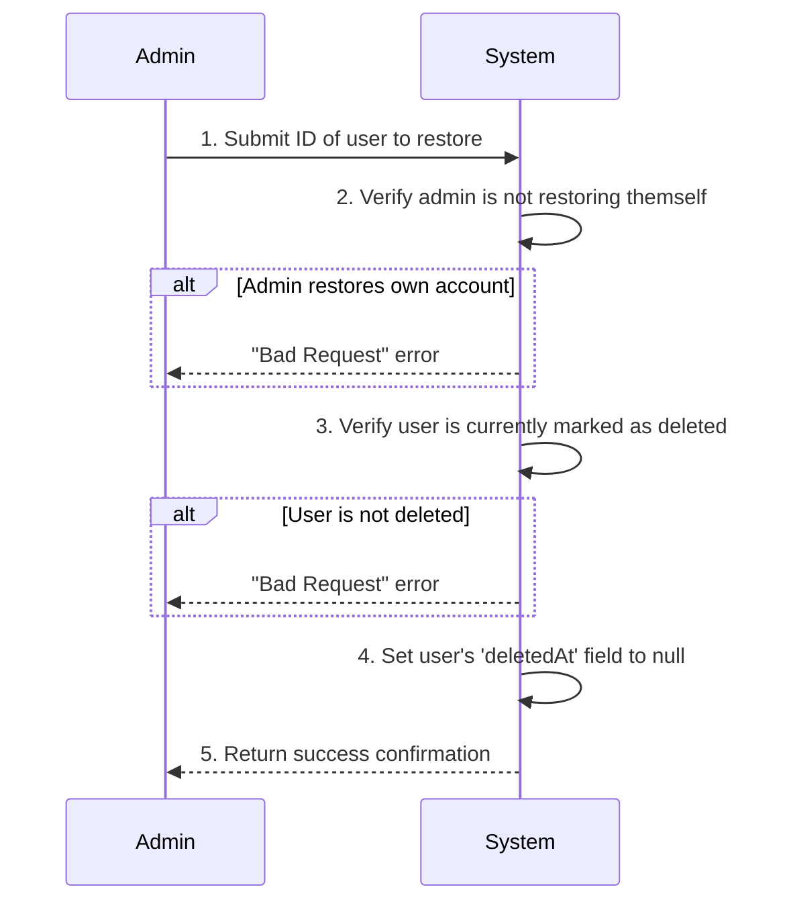
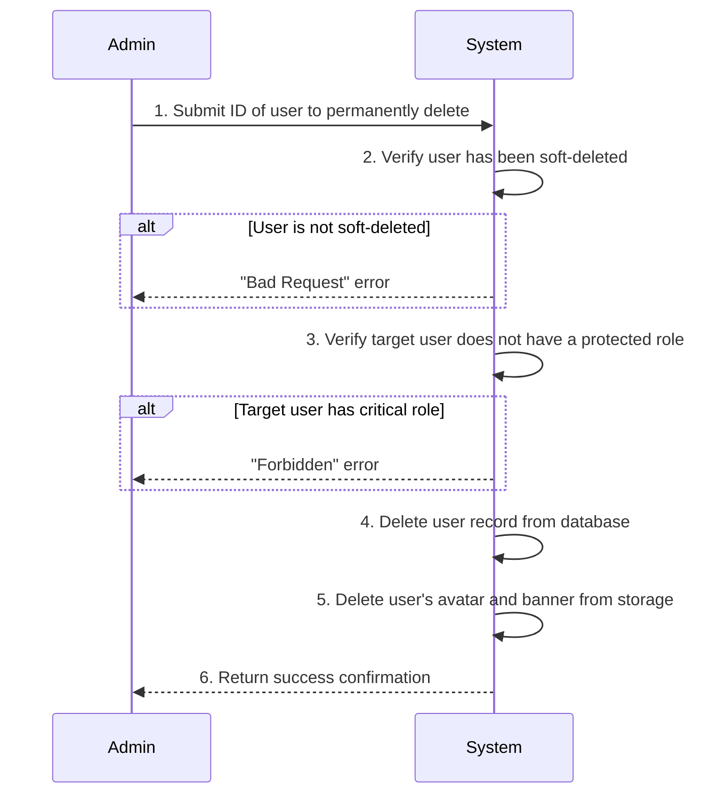
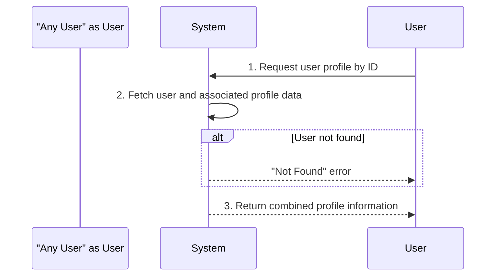
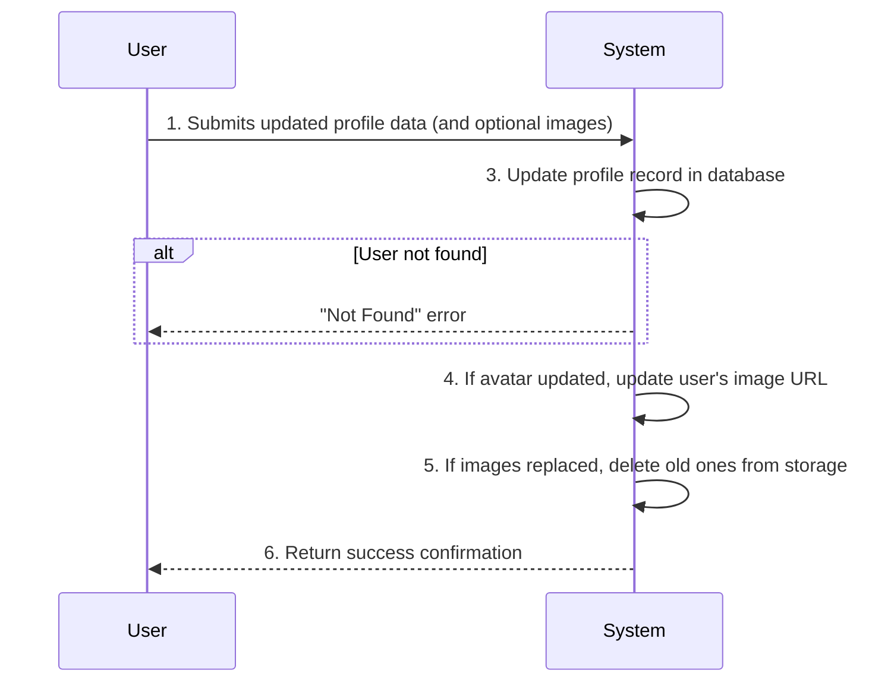

## Get All Users

```mermaid
sequenceDiagram
    participant Admin
    participant System

    Admin->>System: 1. Request user list with filters/pagination
    System->>System: 2. Construct query from filters
    System->>System: 3. Fetch users and total count
    System->>System: 4. Calculate total pages
    System-->>Admin: 5. Return user list and pagination info
```

## Get a Single User

```mermaid
sequenceDiagram
    participant "Admin/Moderator" as User
    participant System

    User->>System: 1. Request user by ID
    System->>System: 2. Fetch user data from database
    alt User not found
        System-->>User: "Not Found" error
    end
    System-->>User: 3. Return user information
```

## Update User

```mermaid
sequenceDiagram
    participant Admin
    participant System

    Admin->>System: 1. Submit user ID and new role/status
    System->>System: 2. Verify admin is not updating themself
    alt Admin updates own account
        System-->>Admin: "Bad Request" error
    end
    System->>System: 3. Verify target user does not have a protected role
    alt Target user has critical role
        System-->>Admin: "Forbidden" error
    end
    System->>System: 4. Update user's record in the database
    System-->>Admin: 5. Return success confirmation
```

## Delete User (Soft Delete)

```mermaid
sequenceDiagram
    participant Admin
    participant System

    Admin->>System: 1. Submit ID of user to delete
    System->>System: 2. Verify admin is not deleting themself
    alt Admin deletes own account
        System-->>Admin: "Bad Request" error
    end
    System->>System: 3. Verify target user does not have a protected role
    alt Target user has critical role
        System-->>Admin: "Forbidden" error
    end
    System->>System: 4. Check if user is already deleted
    alt User is already deleted
        System-->>Admin: "Bad Request" error
    end
    System->>System: 5. Set the 'deletedAt' timestamp for the user
    System-->>Admin: 6. Return success confirmation
```

## Restore User

```mermaid
sequenceDiagram
    participant Admin
    participant System

    Admin->>System: 1. Submit ID of user to restore
    System->>System: 2. Verify admin is not restoring themself
    alt Admin restores own account
        System-->>Admin: "Bad Request" error
    end
    System->>System: 3. Verify user is currently marked as deleted
    alt User is not deleted
        System-->>Admin: "Bad Request" error
    end
    System->>System: 4. Set user's 'deletedAt' field to null
    System-->>Admin: 5. Return success confirmation
```

## Permanently Delete User

```mermaid
sequenceDiagram
    participant Admin
    participant System

    Admin->>System: 1. Submit ID of user to permanently delete
    System->>System: 2. Verify user has been soft-deleted
    alt User is not soft-deleted
        System-->>Admin: "Bad Request" error
    end
    System->>System: 3. Verify target user does not have a protected role
    alt Target user has critical role
        System-->>Admin: "Forbidden" error
    end
    System->>System: 4. Delete user record from database
    System->>System: 5. Delete user's avatar and banner from storage
    System-->>Admin: 6. Return success confirmation
```

## Get User Profile

```mermaid
sequenceDiagram
    participant "Any User" as User
    participant System

    User->>System: 1. Request user profile by ID
    System->>System: 2. Fetch user and associated profile data
    alt User not found
        System-->>User: "Not Found" error
    end
    System-->>User: 3. Return combined profile information
```

## Update User Profile

```mermaid
sequenceDiagram
    participant User
    participant System

    User->>System: 1. Submits updated profile data (and optional images)
    System->>System: 3. Update profile record in database
    alt User not found
        System-->>User: "Not Found" error
    end
    System->>System: 4. If avatar updated, update user's image URL
    System->>System: 5. If images replaced, delete old ones from storage
    System-->>User: 6. Return success confirmation
```
