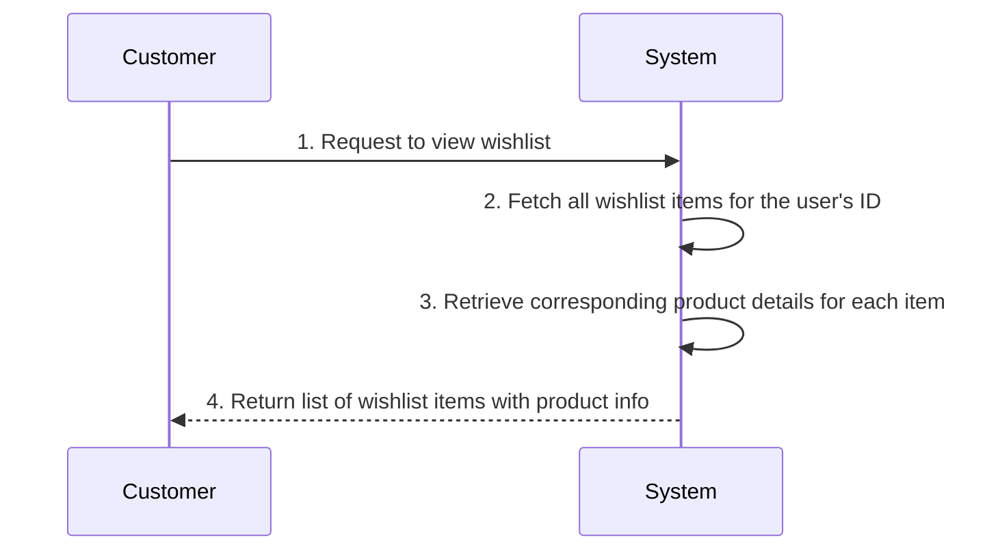
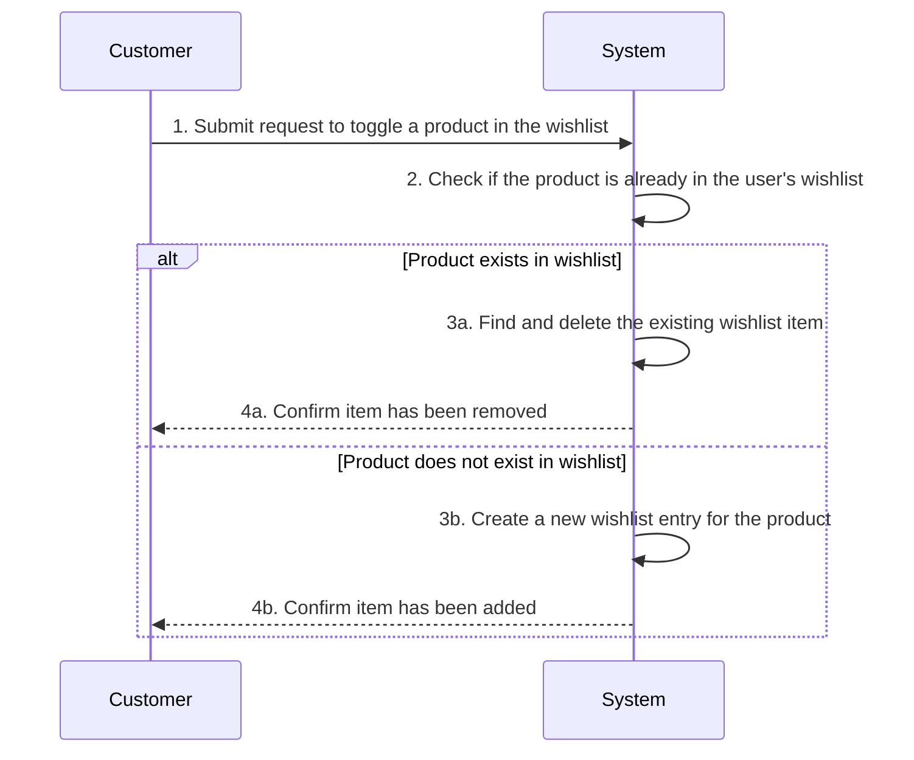

## Get Wishlist Items

```mermaid
sequenceDiagram
    participant Customer
    participant System

    Customer->>System: 1. Request to view wishlist
    System->>System: 2. Fetch all wishlist items for the user's ID
    System->>System: 3. Retrieve corresponding product details for each item
    System-->>Customer: 4. Return list of wishlist items with product info
```

## Add or Remove Item from Wishlist (Toggle)

```mermaid
sequenceDiagram
    participant Customer
    participant System

    Customer->>System: 1. Submit request to toggle a product in the wishlist
    System->>System: 2. Check if the product is already in the user's wishlist
    alt Product exists in wishlist
        System->>System: 3a. Find and delete the existing wishlist item
        System-->>Customer: 4a. Confirm item has been removed
    else Product does not exist in wishlist
        System->>System: 3b. Create a new wishlist entry for the product
        System-->>Customer: 4b. Confirm item has been added
    end
```
